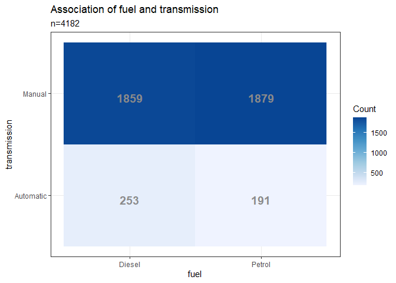
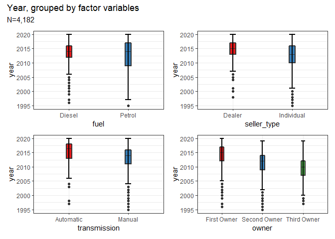
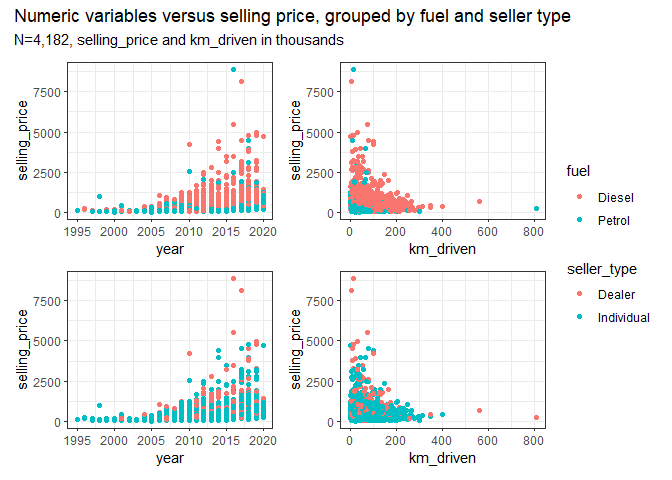
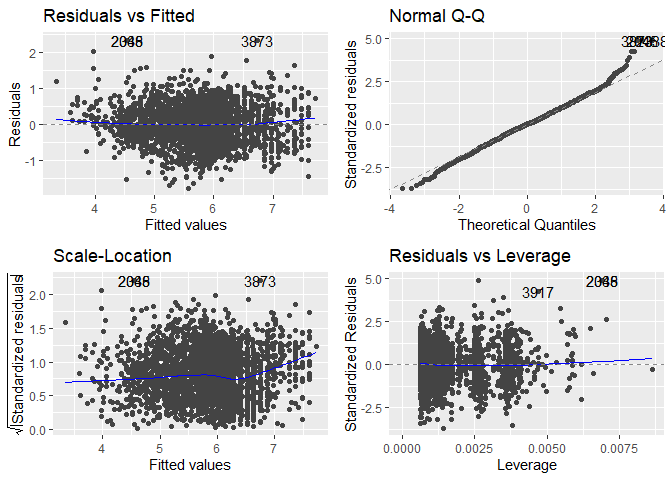
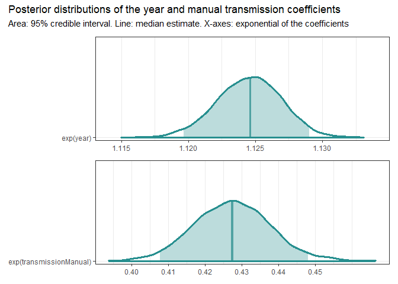
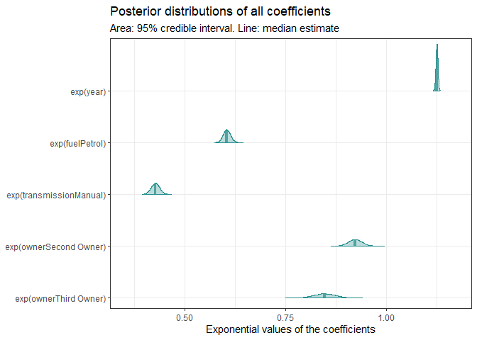

Bayesian Linear Regression - Used Cars Analysis
================
Ahmet Zamanis

-   <a href="#introduction" id="toc-introduction">Introduction</a>
-   <a href="#data-preparation" id="toc-data-preparation">Data
    Preparation</a>
-   <a href="#exploratory-analysis"
    id="toc-exploratory-analysis">Exploratory Analysis</a>
    -   <a href="#distributions" id="toc-distributions">Distributions</a>
    -   <a href="#correlations" id="toc-correlations">Correlations</a>
    -   <a href="#relationships-with-selling-price"
        id="toc-relationships-with-selling-price">Relationships with selling
        price</a>
-   <a href="#ols-linear-regression" id="toc-ols-linear-regression">OLS
    Linear Regression</a>
    -   <a href="#lm1-results" id="toc-lm1-results">lm1 results</a>
    -   <a href="#lm1-diagnostics" id="toc-lm1-diagnostics">lm1 diagnostics</a>
-   <a href="#bayesian-linear-regression"
    id="toc-bayesian-linear-regression">Bayesian Linear Regression</a>
    -   <a href="#blr1-results" id="toc-blr1-results">blr1 results</a>
    -   <a href="#posterior-probability-distributions"
        id="toc-posterior-probability-distributions">Posterior probability
        distributions</a>
    -   <a href="#predicted-vs-real-values-plot"
        id="toc-predicted-vs-real-values-plot">Predicted vs real values plot</a>
    -   <a href="#posterior-predictive-distribution-vs-ols-prediction"
        id="toc-posterior-predictive-distribution-vs-ols-prediction">Posterior
        predictive distribution vs. OLS prediction</a>
-   <a href="#conclusions" id="toc-conclusions">Conclusions</a>

## Introduction

Bayesian Linear Regression is an alternative approach to linear
regression that is based on Bayesian inference, and the Bayes Theorem.
While the better known Ordinary Least Squares approach to linear
regression estimates a single value for the regression model parameters,
the Bayesian approach generates a probability distribution of possible
values for each model parameter. BLR offers some benefits and additional
insight compared to the OLS method:

-   We can more easily quantify and visualize the uncertainty in the
    model, since the output is a range of values for the model
    parameters, instead of single values. A more spread out probability
    distribution for the parameters will mean our model has more
    uncertainty.
-   If we have knowledge or guesses about the prior distributions of
    model parameters, we can use them in building the model as
    informative prior distributions.

In this example analysis, we have a dataset of used cars, which includes
their prices and various features. We will try to predict the price of
used cars, first using regular OLS linear regression, then with BLR. We
will compare their results, and analyze the additional information
provided by BLR.  
  
The dataset was sourced from
[Kaggle](https://www.kaggle.com/datasets/nehalbirla/vehicle-dataset-from-cardekho),
provided by the contributors [Nehal
Birla](https://www.kaggle.com/nehalbirla), [Nishant
Verma](https://www.kaggle.com/nishantverma02) and [Nikhil
Kushawa](https://www.kaggle.com/kushbun27).

## Data Preparation

Let’s load our dataset and view the first 5 rows, along with simple
summary statistics.

  

<div id="hvxmvpjgpt" style="overflow-x:auto;overflow-y:auto;width:auto;height:auto;">
<style>@import url("https://fonts.googleapis.com/css2?family=Calibri:ital,wght@0,100;0,200;0,300;0,400;0,500;0,600;0,700;0,800;0,900;1,100;1,200;1,300;1,400;1,500;1,600;1,700;1,800;1,900&display=swap");
html {
  font-family: Calibri, -apple-system, BlinkMacSystemFont, 'Segoe UI', Roboto, Oxygen, Ubuntu, Cantarell, 'Helvetica Neue', 'Fira Sans', 'Droid Sans', Arial, sans-serif;
}

#hvxmvpjgpt .gt_table {
  display: table;
  border-collapse: collapse;
  margin-left: auto;
  margin-right: auto;
  color: #333333;
  font-size: 16px;
  font-weight: normal;
  font-style: normal;
  background-color: #FFFFFF;
  width: auto;
  border-top-style: solid;
  border-top-width: 2px;
  border-top-color: #A8A8A8;
  border-right-style: none;
  border-right-width: 2px;
  border-right-color: #D3D3D3;
  border-bottom-style: solid;
  border-bottom-width: 2px;
  border-bottom-color: #A8A8A8;
  border-left-style: none;
  border-left-width: 2px;
  border-left-color: #D3D3D3;
}

#hvxmvpjgpt .gt_heading {
  background-color: #FFFFFF;
  text-align: center;
  border-bottom-color: #FFFFFF;
  border-left-style: none;
  border-left-width: 1px;
  border-left-color: #D3D3D3;
  border-right-style: none;
  border-right-width: 1px;
  border-right-color: #D3D3D3;
}

#hvxmvpjgpt .gt_title {
  color: #333333;
  font-size: 125%;
  font-weight: initial;
  padding-top: 4px;
  padding-bottom: 4px;
  padding-left: 5px;
  padding-right: 5px;
  border-bottom-color: #FFFFFF;
  border-bottom-width: 0;
}

#hvxmvpjgpt .gt_subtitle {
  color: #333333;
  font-size: 85%;
  font-weight: initial;
  padding-top: 0;
  padding-bottom: 6px;
  padding-left: 5px;
  padding-right: 5px;
  border-top-color: #FFFFFF;
  border-top-width: 0;
}

#hvxmvpjgpt .gt_bottom_border {
  border-bottom-style: solid;
  border-bottom-width: 2px;
  border-bottom-color: #D3D3D3;
}

#hvxmvpjgpt .gt_col_headings {
  border-top-style: solid;
  border-top-width: 2px;
  border-top-color: #D3D3D3;
  border-bottom-style: solid;
  border-bottom-width: 2px;
  border-bottom-color: #D3D3D3;
  border-left-style: none;
  border-left-width: 1px;
  border-left-color: #D3D3D3;
  border-right-style: none;
  border-right-width: 1px;
  border-right-color: #D3D3D3;
}

#hvxmvpjgpt .gt_col_heading {
  color: #333333;
  background-color: #FFFFFF;
  font-size: 100%;
  font-weight: normal;
  text-transform: inherit;
  border-left-style: none;
  border-left-width: 1px;
  border-left-color: #D3D3D3;
  border-right-style: none;
  border-right-width: 1px;
  border-right-color: #D3D3D3;
  vertical-align: bottom;
  padding-top: 5px;
  padding-bottom: 6px;
  padding-left: 5px;
  padding-right: 5px;
  overflow-x: hidden;
}

#hvxmvpjgpt .gt_column_spanner_outer {
  color: #333333;
  background-color: #FFFFFF;
  font-size: 100%;
  font-weight: normal;
  text-transform: inherit;
  padding-top: 0;
  padding-bottom: 0;
  padding-left: 4px;
  padding-right: 4px;
}

#hvxmvpjgpt .gt_column_spanner_outer:first-child {
  padding-left: 0;
}

#hvxmvpjgpt .gt_column_spanner_outer:last-child {
  padding-right: 0;
}

#hvxmvpjgpt .gt_column_spanner {
  border-bottom-style: solid;
  border-bottom-width: 2px;
  border-bottom-color: #D3D3D3;
  vertical-align: bottom;
  padding-top: 5px;
  padding-bottom: 5px;
  overflow-x: hidden;
  display: inline-block;
  width: 100%;
}

#hvxmvpjgpt .gt_group_heading {
  padding-top: 8px;
  padding-bottom: 8px;
  padding-left: 5px;
  padding-right: 5px;
  color: #333333;
  background-color: #FFFFFF;
  font-size: 100%;
  font-weight: initial;
  text-transform: inherit;
  border-top-style: solid;
  border-top-width: 2px;
  border-top-color: #D3D3D3;
  border-bottom-style: solid;
  border-bottom-width: 2px;
  border-bottom-color: #D3D3D3;
  border-left-style: none;
  border-left-width: 1px;
  border-left-color: #D3D3D3;
  border-right-style: none;
  border-right-width: 1px;
  border-right-color: #D3D3D3;
  vertical-align: middle;
}

#hvxmvpjgpt .gt_empty_group_heading {
  padding: 0.5px;
  color: #333333;
  background-color: #FFFFFF;
  font-size: 100%;
  font-weight: initial;
  border-top-style: solid;
  border-top-width: 2px;
  border-top-color: #D3D3D3;
  border-bottom-style: solid;
  border-bottom-width: 2px;
  border-bottom-color: #D3D3D3;
  vertical-align: middle;
}

#hvxmvpjgpt .gt_from_md > :first-child {
  margin-top: 0;
}

#hvxmvpjgpt .gt_from_md > :last-child {
  margin-bottom: 0;
}

#hvxmvpjgpt .gt_row {
  padding-top: 8px;
  padding-bottom: 8px;
  padding-left: 5px;
  padding-right: 5px;
  margin: 10px;
  border-top-style: solid;
  border-top-width: 1px;
  border-top-color: #D3D3D3;
  border-left-style: none;
  border-left-width: 1px;
  border-left-color: #D3D3D3;
  border-right-style: none;
  border-right-width: 1px;
  border-right-color: #D3D3D3;
  vertical-align: middle;
  overflow-x: hidden;
}

#hvxmvpjgpt .gt_stub {
  color: #333333;
  background-color: #FFFFFF;
  font-size: 100%;
  font-weight: initial;
  text-transform: inherit;
  border-right-style: solid;
  border-right-width: 2px;
  border-right-color: #D3D3D3;
  padding-left: 5px;
  padding-right: 5px;
}

#hvxmvpjgpt .gt_stub_row_group {
  color: #333333;
  background-color: #FFFFFF;
  font-size: 100%;
  font-weight: initial;
  text-transform: inherit;
  border-right-style: solid;
  border-right-width: 2px;
  border-right-color: #D3D3D3;
  padding-left: 5px;
  padding-right: 5px;
  vertical-align: top;
}

#hvxmvpjgpt .gt_row_group_first td {
  border-top-width: 2px;
}

#hvxmvpjgpt .gt_summary_row {
  color: #333333;
  background-color: #FFFFFF;
  text-transform: inherit;
  padding-top: 8px;
  padding-bottom: 8px;
  padding-left: 5px;
  padding-right: 5px;
}

#hvxmvpjgpt .gt_first_summary_row {
  border-top-style: solid;
  border-top-color: #D3D3D3;
}

#hvxmvpjgpt .gt_first_summary_row.thick {
  border-top-width: 2px;
}

#hvxmvpjgpt .gt_last_summary_row {
  padding-top: 8px;
  padding-bottom: 8px;
  padding-left: 5px;
  padding-right: 5px;
  border-bottom-style: solid;
  border-bottom-width: 2px;
  border-bottom-color: #D3D3D3;
}

#hvxmvpjgpt .gt_grand_summary_row {
  color: #333333;
  background-color: #FFFFFF;
  text-transform: inherit;
  padding-top: 8px;
  padding-bottom: 8px;
  padding-left: 5px;
  padding-right: 5px;
}

#hvxmvpjgpt .gt_first_grand_summary_row {
  padding-top: 8px;
  padding-bottom: 8px;
  padding-left: 5px;
  padding-right: 5px;
  border-top-style: double;
  border-top-width: 6px;
  border-top-color: #D3D3D3;
}

#hvxmvpjgpt .gt_striped {
  background-color: rgba(128, 128, 128, 0.05);
}

#hvxmvpjgpt .gt_table_body {
  border-top-style: solid;
  border-top-width: 2px;
  border-top-color: #D3D3D3;
  border-bottom-style: solid;
  border-bottom-width: 2px;
  border-bottom-color: #D3D3D3;
}

#hvxmvpjgpt .gt_footnotes {
  color: #333333;
  background-color: #FFFFFF;
  border-bottom-style: none;
  border-bottom-width: 2px;
  border-bottom-color: #D3D3D3;
  border-left-style: none;
  border-left-width: 2px;
  border-left-color: #D3D3D3;
  border-right-style: none;
  border-right-width: 2px;
  border-right-color: #D3D3D3;
}

#hvxmvpjgpt .gt_footnote {
  margin: 0px;
  font-size: 90%;
  padding-left: 4px;
  padding-right: 4px;
  padding-left: 5px;
  padding-right: 5px;
}

#hvxmvpjgpt .gt_sourcenotes {
  color: #333333;
  background-color: #FFFFFF;
  border-bottom-style: none;
  border-bottom-width: 2px;
  border-bottom-color: #D3D3D3;
  border-left-style: none;
  border-left-width: 2px;
  border-left-color: #D3D3D3;
  border-right-style: none;
  border-right-width: 2px;
  border-right-color: #D3D3D3;
}

#hvxmvpjgpt .gt_sourcenote {
  font-size: 90%;
  padding-top: 4px;
  padding-bottom: 4px;
  padding-left: 5px;
  padding-right: 5px;
}

#hvxmvpjgpt .gt_left {
  text-align: left;
}

#hvxmvpjgpt .gt_center {
  text-align: center;
}

#hvxmvpjgpt .gt_right {
  text-align: right;
  font-variant-numeric: tabular-nums;
}

#hvxmvpjgpt .gt_font_normal {
  font-weight: normal;
}

#hvxmvpjgpt .gt_font_bold {
  font-weight: bold;
}

#hvxmvpjgpt .gt_font_italic {
  font-style: italic;
}

#hvxmvpjgpt .gt_super {
  font-size: 65%;
}

#hvxmvpjgpt .gt_two_val_uncert {
  display: inline-block;
  line-height: 1em;
  text-align: right;
  font-size: 60%;
  vertical-align: -0.25em;
  margin-left: 0.1em;
}

#hvxmvpjgpt .gt_footnote_marks {
  font-style: italic;
  font-weight: normal;
  font-size: 75%;
  vertical-align: 0.4em;
}

#hvxmvpjgpt .gt_asterisk {
  font-size: 100%;
  vertical-align: 0;
}

#hvxmvpjgpt .gt_slash_mark {
  font-size: 0.7em;
  line-height: 0.7em;
  vertical-align: 0.15em;
}

#hvxmvpjgpt .gt_fraction_numerator {
  font-size: 0.6em;
  line-height: 0.6em;
  vertical-align: 0.45em;
}

#hvxmvpjgpt .gt_fraction_denominator {
  font-size: 0.6em;
  line-height: 0.6em;
  vertical-align: -0.05em;
}
</style>
<table class="gt_table">
  <thead class="gt_header">
    <tr>
      <th colspan="9" class="gt_heading gt_title gt_font_normal gt_bottom_border" style>Used cars dataset</th>
    </tr>
    
  </thead>
  <thead class="gt_col_headings">
    <tr>
      <th class="gt_col_heading gt_columns_bottom_border gt_left" rowspan="1" colspan="1"></th>
      <th class="gt_col_heading gt_columns_bottom_border gt_left" rowspan="1" colspan="1" style="border-bottom-width: 3px; border-bottom-style: solid; border-bottom-color: #000000; font-weight: bold;">name</th>
      <th class="gt_col_heading gt_columns_bottom_border gt_right" rowspan="1" colspan="1" style="border-bottom-width: 3px; border-bottom-style: solid; border-bottom-color: #000000; font-weight: bold;">year</th>
      <th class="gt_col_heading gt_columns_bottom_border gt_right" rowspan="1" colspan="1" style="border-bottom-width: 3px; border-bottom-style: solid; border-bottom-color: #000000; font-weight: bold;">selling_price</th>
      <th class="gt_col_heading gt_columns_bottom_border gt_right" rowspan="1" colspan="1" style="border-bottom-width: 3px; border-bottom-style: solid; border-bottom-color: #000000; font-weight: bold;">km_driven</th>
      <th class="gt_col_heading gt_columns_bottom_border gt_center" rowspan="1" colspan="1" style="border-bottom-width: 3px; border-bottom-style: solid; border-bottom-color: #000000; font-weight: bold;">fuel</th>
      <th class="gt_col_heading gt_columns_bottom_border gt_center" rowspan="1" colspan="1" style="border-bottom-width: 3px; border-bottom-style: solid; border-bottom-color: #000000; font-weight: bold;">seller_type</th>
      <th class="gt_col_heading gt_columns_bottom_border gt_center" rowspan="1" colspan="1" style="border-bottom-width: 3px; border-bottom-style: solid; border-bottom-color: #000000; font-weight: bold;">transmission</th>
      <th class="gt_col_heading gt_columns_bottom_border gt_center" rowspan="1" colspan="1" style="border-bottom-width: 3px; border-bottom-style: solid; border-bottom-color: #000000; font-weight: bold;">owner</th>
    </tr>
  </thead>
  <tbody class="gt_table_body">
    <tr><td class="gt_row gt_right gt_stub">1</td>
<td class="gt_row gt_left">Maruti 800 AC</td>
<td class="gt_row gt_right">2007</td>
<td class="gt_row gt_right">60000</td>
<td class="gt_row gt_right">70000</td>
<td class="gt_row gt_center">Petrol</td>
<td class="gt_row gt_center">Individual</td>
<td class="gt_row gt_center">Manual</td>
<td class="gt_row gt_center">First Owner</td></tr>
    <tr><td class="gt_row gt_right gt_stub">2</td>
<td class="gt_row gt_left">Maruti Wagon R LXI Minor</td>
<td class="gt_row gt_right">2007</td>
<td class="gt_row gt_right">135000</td>
<td class="gt_row gt_right">50000</td>
<td class="gt_row gt_center">Petrol</td>
<td class="gt_row gt_center">Individual</td>
<td class="gt_row gt_center">Manual</td>
<td class="gt_row gt_center">First Owner</td></tr>
    <tr><td class="gt_row gt_right gt_stub">3</td>
<td class="gt_row gt_left">Hyundai Verna 1.6 SX</td>
<td class="gt_row gt_right">2012</td>
<td class="gt_row gt_right">600000</td>
<td class="gt_row gt_right">100000</td>
<td class="gt_row gt_center">Diesel</td>
<td class="gt_row gt_center">Individual</td>
<td class="gt_row gt_center">Manual</td>
<td class="gt_row gt_center">First Owner</td></tr>
    <tr><td class="gt_row gt_right gt_stub">4</td>
<td class="gt_row gt_left">Datsun RediGO T Option</td>
<td class="gt_row gt_right">2017</td>
<td class="gt_row gt_right">250000</td>
<td class="gt_row gt_right">46000</td>
<td class="gt_row gt_center">Petrol</td>
<td class="gt_row gt_center">Individual</td>
<td class="gt_row gt_center">Manual</td>
<td class="gt_row gt_center">First Owner</td></tr>
    <tr><td class="gt_row gt_right gt_stub">5</td>
<td class="gt_row gt_left">Honda Amaze VX i-DTEC</td>
<td class="gt_row gt_right">2014</td>
<td class="gt_row gt_right">450000</td>
<td class="gt_row gt_right">141000</td>
<td class="gt_row gt_center">Diesel</td>
<td class="gt_row gt_center">Individual</td>
<td class="gt_row gt_center">Manual</td>
<td class="gt_row gt_center">Second Owner</td></tr>
  </tbody>
  
  
</table>
</div>

  

    ##      name                year      selling_price       km_driven     
    ##  Length:4340        Min.   :1992   Min.   :  20000   Min.   :     1  
    ##  Class :character   1st Qu.:2011   1st Qu.: 208750   1st Qu.: 35000  
    ##  Mode  :character   Median :2014   Median : 350000   Median : 60000  
    ##                     Mean   :2013   Mean   : 504127   Mean   : 66216  
    ##                     3rd Qu.:2016   3rd Qu.: 600000   3rd Qu.: 90000  
    ##                     Max.   :2020   Max.   :8900000   Max.   :806599  
    ##        fuel                seller_type      transmission 
    ##  CNG     :  40   Dealer          : 994   Automatic: 448  
    ##  Diesel  :2153   Individual      :3244   Manual   :3892  
    ##  Electric:   1   Trustmark Dealer: 102                   
    ##  LPG     :  23                                           
    ##  Petrol  :2123                                           
    ##                                                          
    ##                   owner     
    ##  Test Drive Car      :  17  
    ##  First Owner         :2832  
    ##  Second Owner        :1106  
    ##  Third Owner         : 304  
    ##  Fourth & Above Owner:  81  
    ## 

The original dataset has 4340 observations, 8 columns. The variables in
the original dataset are:

-   name: Name of the car model. Character variable.
-   year: Year of the car model. Numeric variable.
-   selling_price: Selling price of the car. Numeric variable. The
    outcome variable we will try to predict.
-   km_driven: The distance traveled by the car, in kilometers. Numeric
    variable.
-   fuel: The fuel type of the car. Factor variable with five levels.
-   seller_type: The car’s seller. Factor variable with three levels.
-   transmission: The car’s transmission type. Factor variable with two
    levels.
-   owner: Number of previous owners. Factor variable with five levels.

There are some data cleaning and recoding steps to consider:

-   Selling price and kilometers driven are both large numbers, in
    hundreds of thousands and millions. Let’s divide both by 1000 to get
    them in units of thousands.
-   The fuel types CNG, LPG and Electric have very few observations,
    compared to Petrol and Diesel which have almost the same number of
    observations. We may want to drop the fuel categories besides Petrol
    and Diesel, to achieve a simpler, almost perfectly balanced
    variable.
-   Similarly, there are few observations with the “Trustmark Dealer”
    seller type. We can recode these as “Dealer” type observations.
-   There are few observations with “Test Drive Car” and “Fourth & Above
    Owner” levels in the owner variable. Furthermore, without Test Drive
    Cars, number of owners would be a naturally ordered factor variable.
    We can drop observations with “Test Drive Car” and “Fourth & Above
    Owner”, along with these levels of the owner variable.

<!-- -->

    ##      name                year      selling_price      km_driven      
    ##  Length:4182        Min.   :1995   Min.   :  20.0   Min.   :  0.001  
    ##  Class :character   1st Qu.:2011   1st Qu.: 211.2   1st Qu.: 35.000  
    ##  Mode  :character   Median :2014   Median : 370.0   Median : 60.000  
    ##                     Mean   :2013   Mean   : 512.4   Mean   : 65.724  
    ##                     3rd Qu.:2016   3rd Qu.: 600.0   3rd Qu.: 90.000  
    ##                     Max.   :2020   Max.   :8900.0   Max.   :806.599  
    ##      fuel          seller_type      transmission           owner     
    ##  Diesel:2112   Dealer    :1066   Automatic: 444   First Owner :2801  
    ##  Petrol:2070   Individual:3116   Manual   :3738   Second Owner:1081  
    ##                                                   Third Owner : 300  
    ##                                                                      
    ##                                                                      
    ## 

With these changes, we have a dataset of 4182 variables, and simplified,
less unbalanced factor variables.

## Exploratory Analysis

### Distributions

Let’s look at the distributions of our numeric variables.  
<!-- -->  
Our outcome variable, selling price, follows a very right skewed
distribution. There are numerous very large outliers compared to the
median and the interquartile range.

-   While the minimum value is 20k, and the median 370k, the maximum is
    8.9m, with numerous observations at a price level higher than 1m.
    -   It may be sensible to remove the very high priced cars from the
        dataset, and try to predict the prices of more “ordinary” cars,
        as different price segments are likely to have different
        dynamics.
    -   However, since we want a model with some uncertainty to
        demonstrate the merits of BLR, we will keep the entire dataset
        for this analysis.

<!-- -->  

-   The year variable is left skewed, with a median year of 2014. Most
    cars in our dataset are newer models, roughly after 2010. Very few
    cars are from before 2005. Half of the cars are from 2011-2016.
-   The km_driven variable is very right skewed, with a median of 60k,
    and a maximum of 806k.
    -   There are numerous cars with hundreds of thousands of kilometers
        driven. One observation has only 1 kilometer driven.

Let’s look at the balances of our factor variables.  
<!-- -->  

-   Fuel type is balanced almost perfectly between diesel and petrol.
-   Previous owners is unbalanced, most cars are from first owners, and
    very few are from third owners.
-   Seller type is unbalanced, most cars are from individual sellers.
-   Transmission type is very unbalanced, most cars are manual
    transmission cars.

### Correlations

Let’s check the correlations between our variables, starting with the
numeric variables.  
<!-- -->  

-   There is a moderate, positive correlation of 0.4 between year and
    selling price. The coefficient is highly statistically significant.
    -   The scatterplot suggests a non-linear, exponential-like
        relationship. We can see some outliers with much higher selling
        prices compared to observations in their year. Again, these are
        the luxury cars with millions in selling price, likely subject
        to different pricing dynamics.
-   There is a moderate, negative correlation of -0.42 between year and
    km_driven. The coefficient is highly statistically significant.
    -   The scatterplot suggests a non-linear relationship, where
        kilometers driven increases from 1995 to around 2010, and
        declines again after 2010.
    -   This is likely due to a lack of observations from older years,
        as most cars in our dataset are from 2010 and onwards.
        Intuitively, we would expect older cars to have higher
        kilometers driven. It’s possible that older cars with higher
        kilometers are not put up for sale.
-   The correlation between kilometers driven and selling price is weak,
    with a negative coefficient of -0.18. The coefficient is highly
    statistically significant.
    -   Before a selling price of roughly 1.25m, we have some cars with
        kilometers driven above 200k. But after a selling price of
        roughly 1.25m, all cars are below 100k kilometers.
    -   It’s likely that very high-priced, luxury or classic cars are
        driven less than ordinary, daily driver cars.

  
Let’s check the degrees of association between our factor variables,
with tile plots and chi-square tests.  
<!-- -->

    ## 
    ##  Pearson's Chi-squared test with Yates' continuity correction
    ## 
    ## data:  tchi1
    ## X-squared = 4.5774, df = 1, p-value = 0.0324

We see that dealers are a bit more likely to sell diesel cars, while
individuals are a bit more likely to sell petrol cars. The association
is weak but statistically significant.  
  
<!-- -->

    ## 
    ##  Pearson's Chi-squared test with Yates' continuity correction
    ## 
    ## data:  tchi2
    ## X-squared = 8.0562, df = 1, p-value = 0.004535

Automatic cars are a bit more likely to be diesel, and manual cars are a
bit more likely to be petrol. Again, a weak but statistically
significant association.  
  
<!-- -->

    ## 
    ##  Pearson's Chi-squared test
    ## 
    ## data:  tchi3
    ## X-squared = 0.5651, df = 2, p-value = 0.7539

There is no significant association between fuel type and number of
owners.  
  
<!-- -->

    ## 
    ##  Pearson's Chi-squared test with Yates' continuity correction
    ## 
    ## data:  tchi4
    ## X-squared = 192.08, df = 1, p-value < 0.00000000000000022

Individual sellers are much more likely to sell manual cars compared to
dealers. This is a strong, highly statistically significant
association.  
  
<!-- -->

    ## 
    ##  Pearson's Chi-squared test
    ## 
    ## data:  tchi5
    ## X-squared = 284.24, df = 2, p-value < 0.00000000000000022

Dealers sell roughly 1/3rd of first owner cars, 1/10th of second owner
cars, and 1/33th of third owner cars. There is a very strong and highly
statistically significant association between these variables. Dealers
strongly prefer selling first owner cars.  
  
<!-- -->

    ## 
    ##  Pearson's Chi-squared test
    ## 
    ## data:  tchi6
    ## X-squared = 30.363, df = 2, p-value = 0.0000002552

First owner cars are a bit more likely to be automatic transmission
cars. There is a moderate, statistically significant association between
these variables.  
  

Finally, let’s look at the relationships between numeric and factor
variables, using boxplots of numeric variables grouped by factor
variables.  
<!-- --><!-- -->  

-   We see that diesel cars tend to be priced higher than petrol cars.
-   Cars sold by dealers tend to be priced a bit higher than cars sold
    by individuals.
-   Automatic transmission cars tend to be priced much higher than
    manuals.
-   The more previous owners a car has, the lower it is priced. The
    effect is more pronounced for first owner cars, and less so between
    second and third owner cars.

  
<!-- -->  

-   Overall, diesel cars tend to be a bit newer than petrol cars, though
    there are numerous older diesels as well.
-   Cars sold by dealers tend to be a bit newer compared to cars sold by
    individuals.
-   Automatic transmission cars tend to be a bit newer compared to
    manuals.
-   Generally, the more previous owners a car has, the older it is.

  
<!-- --><!-- -->  

-   Diesel cars tend to have higher kilometers driven compared to
    petrols. This is expected as diesel engines are known to be more
    durable.
-   Cars sold by individuals tend to have higher kilometers driven
    compared to cars sold by dealers.
-   Manual transmission cars tend to have higher kilometers driven
    compared to automatics.
-   Generally, cars with more previous owners tend to have higher
    kilometers driven, though there are some first owner cars with the
    highest kilometers driven among the cars in the dataset.

### Relationships with selling price

Now let’s consider the relationships between selling price, and the
other variables in our dataset. We have already done this to a degree
with our correlations analysis above. For factor variables, we can say:

-   Fuel type has a moderate relationship with selling price. Diesel
    cars are more expensive than petrol cars.
-   Transmission type has a strong relationship with selling price.
    Automatic cars tend to be more expensive, though we have few
    observations with automatic transmissions..
-   Previous owners has a moderate relationship with selling price.
    First owner cars tend to be more expensive, but the effect for
    second and third owner cars is less clear, as there are few
    observations with these levels.
-   Seller type has a somewhat weaker relationship with selling price.
    Cars sold by dealers tend to be priced a bit higher.

Let’s use scatterplots to better visualize the relationship between the
two numeric predictors, year and km_driven, and the selling prices.
Let’s also group the observations by the factor variables for more
possible insights.  
<!-- -->  
<!-- -->  

-   Selling price tends to increase with year, in a non-linear,
    exponential-like fashion.
    -   Diesels, automatics, dealer cars and first owner cars all tend
        to be newer, and higher priced.
-   Selling price doesn’t have a clear relationship with kilometers
    driven, though there are no cars priced above roughly 1.25m with
    more than 200k kilometers driven.
    -   Automatics, dealer cars and first owner cars all tend to have
        lower kilometers.

## OLS Linear Regression

Before we fit an OLS linear regression model, there are a few
transformations we need to consider:

-   Our outcome variable, selling price, follows a non-normal
    distribution. We will use the log transformed version as the outcome
    variable in our regression, to try and satisfy the normality of
    residuals assumption.
-   The relationship between year and selling price is likely
    exponential and not linear. Since we will apply a log transformation
    to selling price, we don’t need to apply an exponential
    transformation to year.

As for variable choice, we saw that year, fuel type, transmission type
and owner type are all potential predictors of selling price. There is
no apparent strong correlation within these variables, so we can include
all of them as predictors.  
  
Kilometers driven and seller type exhibit weak relationships with
selling price. Besides, they may be largely caused by the other
variables in our dataset:

-   Kilometers driven is correlated / associated with year and fuel
    type. Diesel engines tend to last longer than petrol engines, and
    intuitively we would expect older cars to be driven for longer
    distances. We can consider km_driven largely as a consequence of
    fuel type and year, rather than a separate predictor.
-   Similarly, seller type is associated with transmission type and
    owner type. It’s likely that dealers prefer automatic, first owner
    cars, as well as possibly newer, automatic and lower kilometer cars.
    Again, we can consider dealer type as a consequence of the other
    predictors in our dataset.
-   These variables are largely caused by the other predictors, while
    not being significant predictors of the outcome variable themselves.
    Including them in our model would lead to selection bias: Some of
    the effects of the true predictors on the outcome variable would be
    held constant, leading to misleading results about the effects of
    our true predictor variables.

Therefore, we will keep kilometers driven and seller type out of our
regression model.

### lm1 results

Let’s fit our first linear model, with the log transformed selling price
as the outcome variable, and year, fuel, transmission, owner as our
predictor variables.

``` r
lm1 <- lm(log(selling_price) ~ year + fuel + transmission + owner, data=df)
summary(lm1)
```

    ## 
    ## Call:
    ## lm(formula = log(selling_price) ~ year + fuel + transmission + 
    ##     owner, data = df)
    ## 
    ## Residuals:
    ##      Min       1Q   Median       3Q      Max 
    ## -1.77309 -0.29788  0.00815  0.31172  2.35456 
    ## 
    ## Coefficients:
    ##                       Estimate  Std. Error t value             Pr(>|t|)    
    ## (Intercept)        -229.245853    4.136982 -55.414 < 0.0000000000000002 ***
    ## year                  0.117310    0.002052  57.171 < 0.0000000000000002 ***
    ## fuelPetrol           -0.504037    0.015026 -33.543 < 0.0000000000000002 ***
    ## transmissionManual   -0.850391    0.024433 -34.805 < 0.0000000000000002 ***
    ## ownerSecond Owner    -0.081459    0.018610  -4.377         0.0000123193 ***
    ## ownerThird Owner     -0.166369    0.031027  -5.362         0.0000000867 ***
    ## ---
    ## Signif. codes:  0 '***' 0.001 '**' 0.01 '*' 0.05 '.' 0.1 ' ' 1
    ## 
    ## Residual standard error: 0.4811 on 4176 degrees of freedom
    ## Multiple R-squared:  0.6665, Adjusted R-squared:  0.6661 
    ## F-statistic:  1669 on 5 and 4176 DF,  p-value: < 0.00000000000000022

-   Our model explains 67% of the variance in the selling prices.
-   All predictors are highly significant, with p-values close to zero.
-   Year has a positive effect on price, while the other predictors all
    have negative effects.
-   The intercept is -229, which is very close to 0 when we reverse the
    log transformation.

Since the coefficients are log transformed, let’s reverse the
transformations, convert them into percentage changes, and get the 95%
confidence intervals.

    ##                        2.5 %   estimate     97.5 %
    ## year                11.99531  12.446749  12.900012
    ## fuelPetrol         -41.34493 -39.591267 -37.785173
    ## transmissionManual -59.27353 -57.275207 -55.178830
    ## ownerSecond Owner  -11.12550  -7.822957  -4.397695
    ## ownerThird Owner   -20.32377 -15.326617 -10.016050

Here’s how to interpret these transformed coefficient estimates, and the
confidence intervals:

-   Increasing year by 1 is expected to increase price by 12.44%,
    holding everything else constant. The 95% confidence interval is
    12-13%: There is a 95% chance the true mean of the coefficient
    translates into a 12-13% increase in price.
-   A petrol car is expected to sell for 40% less compared to a diesel
    car.
-   A manual transmission car is expected to sell for 57% less compared
    to an automatic.
-   A second owner car is expected to sell for 8% less, and a third
    owner car for 15% less, compared to a first owner car.

Another way to visualize the individual effect of each variable on
price, while holding the effects of other variables constant, is with
added variable plots:  
<!-- -->

-   Year has the biggest effect on price: A positive, approximately
    linear increase. The log transformation of selling price apparently
    worked well to capture the relationship between year and selling
    price.
    -   Year had the second smallest coefficient, but this can be
        misleading: The coefficients are unit effects on price, and year
        is a numeric variable with a range of values from 1995-2020. The
        other variables are factor variables with 2 or 3 levels.
        Therefore, year has more potential to affect the price.
        -   For example, going from a year value of 1995 to 2020, while
            keeping other predictors constant, we can expect the new
            price to be (1.12)^25 times the old one. That is 17 times
            the original price!
-   Transmission has the second biggest effect on price: A decline for
    manual transmission cars, or an increase for automatics.
-   Then fuel: A decline for petrol cars, or an increase for diesels.
-   Finally owner type: A small decline for second owners, and a
    slightly bigger decline for third owners.

### lm1 diagnostics

Let’s plot the diagnostic graphs for lm1, and see if our model fits the
assumptions for an OLS linear regression.  
<!-- -->

    ##                  GVIF Df GVIF^(1/(2*Df))
    ## year         1.286950  1        1.134438
    ## fuel         1.019771  1        1.009837
    ## transmission 1.023523  1        1.011693
    ## owner        1.253309  2        1.058070

-   The linearity assumption is generally satisfied, as there are no
    strong patterns in the residuals vs fitted plot.
-   The normality of residuals assumption generally holds, but the
    residuals for the highest quantiles deviate from normality, which is
    likely because of the higher priced, luxury cars in our dataset not
    being predicted well.
-   The equal variance assumption is generally satisfied, as there are
    no strong patterns in the scale-location plot. However, the
    residuals for the highest fitted values are considerably higher,
    again likely due to the high-priced luxury cars being poorly
    predicted.
-   There are no particularly high leverage observations present. There
    are a few outliers in terms of standardized residuals.
-   The variance inflation factors for all variables are between 1-1.3,
    meaning there are no multicollinearity issues present in our model.

Another way to visually assess the model’s fit is to plot the fitted
values against the real observed values. Let’s do this, while reversing
the log transformations on the model’s predictions.  
<!-- -->  
While the fitted vs. observed values are reasonably close to following a
straight line, quite a few observations, especially higher priced cars
above 2.5m, are vastly underpredicted. We expected this from our
exploratory analysis, and splitting the data can offer more accurate
predictions, but for the sake of our example, let’s stick with these
results.

## Bayesian Linear Regression

Now, let’s fit a BLR model with the same formula as lm1. We will go over
the outputs of a BLR model, and compare them with the outputs of our OLS
model lm1. Our outcome variable is log transformed, which leads to a
distribution reasonably close to a standard normal distribution, so we
will leave the default setting of a normal distribution as the prior
distribution. We don’t have any prior information on the regression
coefficients’ distributions, so we will leave them default too.

### blr1 results

Our BLR model is constructed with a Markov Chain Monte Carlo algorithm,
which draws random samples from the model parameters’ distribution. Each
iteration of a BLR model will yield different results, so we need to set
seed to get replicable outputs.

``` r
set.seed(1)
blr1 <- stan_glm(log(selling_price) ~ year + fuel + transmission + owner, 
                 data=df, seed=1)
```

The coefficients of the model blr1 are log transformed, so let’s reverse
the transformations, convert them into percentage changes, and see the
posterior distributions of the model parameters.

    ## Summary of Posterior Distribution
    ## 
    ## Parameter          | Median |           95% CI |   pd |          ROPE | % in ROPE |  Rhat |     ESS
    ## ---------------------------------------------------------------------------------------------------
    ## year               |  12.46 | [ 11.96,  12.90] | 100% | [-1.00, 1.01] |        0% | 0.999 | 4329.00
    ## fuelPetrol         | -39.58 | [-41.30, -37.76] | 100% | [-1.00, 1.01] |        0% | 1.000 | 5993.00
    ## transmissionManual | -57.26 | [-59.22, -55.19] | 100% | [-1.00, 1.01] |        0% | 1.000 | 5666.00
    ## ownerSecond Owner  |  -7.81 | [-11.10,  -4.32] | 100% | [-1.00, 1.01] |        0% | 1.000 | 4917.00
    ## ownerThird Owner   | -15.35 | [-20.29,  -9.90] | 100% | [-1.00, 1.01] |        0% | 1.000 | 4602.00

Let’s compare these with the estimated coefficients of lm1, and their
95% confidence intervals.

    ##                        2.5 %   estimate     97.5 %
    ## year                11.99531  12.446749  12.900012
    ## fuelPetrol         -41.34493 -39.591267 -37.785173
    ## transmissionManual -59.27353 -57.275207 -55.178830
    ## ownerSecond Owner  -11.12550  -7.822957  -4.397695
    ## ownerThird Owner   -20.32377 -15.326617 -10.016050

We can see that the estimates of lm1 and blr1 are very close. The 95%
confidence intervals of lm1 are also very close to the 95% credible
intervals of blr1. However, their interpretations are a bit different:

-   The estimates of lm1 are estimated means of the regression
    coefficients, while the estimates of blr1 are the estimated medians.
-   With an OLS linear regression model, there is a 95% chance that the
    true mean of the coefficient lies within the 95% confidence
    interval.
-   With a BLR model, 95% of all coefficient estimates lie within the
    95% credible interval.

We also have a few metrics to assess the accuracy of each parameter in
blr1:

-   pd is the probability that the direction of the coefficient is true.
    This is 100% for all our coefficients.
-   ROPE is a range close to zero, which is considered practically zero.
    If the credible interval for a coefficient is fully covered by the
    ROPE, we can consider the effect of that variable to be practically
    zero. All the coefficients in our model are fully outside the ROPE.
    -   The interpretation of “% in ROPE” is somewhat similar to the
        p-value in OLS: x% in ROPE means there is a x% chance that the
        effect is not significant.
-   Rhat is the scale reduction factor. If it is close to 1, the MCMC
    algorithm came close to reaching convergence. In our case, all Rhat
    values are 1 or very close.
-   ESS is effective sample saze, the number of independent draws that
    give us the same information as the MCMC algorithm. Generally, a
    high ESS, higher than 400, means the MCMC was informative. In our
    case, the lowest ESS is 4329.

### Posterior probability distributions

BLR generates a posterior probability distribution for the model
parameters, which can help visualize their level of uncertainty. Let’s
plot the posterior distributions of our model coefficients, with the log
transformations reversed. Keep in mind that the X-axis values in the
below plots are just exponents of the log coefficients. The closer they
are to 1, the smaller their effect on price. A coefficient greater than
1 has a positive effect on price, and smaller than 1 has a negative
effect on price.  
  
Let’s plot the posterior probability distributions of the model
coefficients.  
<!-- -->  
<!-- -->  
<!-- -->  
  
If we want to compare the effect and uncertainty of each coefficient, we
can plot their distributions together, though it will be hard to see the
distribution for each individual coefficient this way.  

<!-- -->  
In this plot, coefficients that are farther away from 1 have a bigger
unit effect on the price, coefficients greater than 1 have a positive
effect, and coefficients smaller than 1 have a negative effect.

-   Manual transmission has the biggest unit effect on price, with a
    negative effect.
-   Petrol fuel follows with a negative effect.
-   Third owner and second owner coefficients have smaller negative
    effects on price, in that order of effectiveness.
-   Year has the second smallest unit effect on the price, after second
    owner.
    -   Again, keep in mind that year is numeric and its values range
        from 1995 to 2020, and the other predictors are all factor
        predictors with 2-3 levels, so year has a bigger potential
        effect on price overall.

The ranges of the coefficient posterior distributions give us an idea
about their uncertainty.

-   Year’s coefficient has the narrowest range, which means the effect
    of this variable has the least amount of uncertainty.
-   In contrast, third owner’s coefficient has the widest range, making
    it the variable with the most uncertain effect.
-   This is expected, as there are very few observations of the second
    and third owner types.

The BLR model also gives us a posterior probability distribution for the
predicted values of the outcome variable. We can plot this against the
distribution of the original selling price in our dataset, to check if
the predictions fit well with the original data.  
<!-- -->  
Overall, the posterior probability distributions are reasonably close to
the distribution of the original outcome variable, though there are
considerable deviations in certain ranges. We can see from these plots
that the log transformation brought the distribution of selling price
reasonably close to a normal distribution.

### Predicted vs real values plot

We can plot the average selling prices predicted by blr1, against the
actual values of selling price, just like we did with lm1. This will
yield very similar results, as the average estimates of blr1 are very
close to the estimates of lm1.  
<!-- -->  
We can see that the average fitted values of blr1 are practically the
same with the fitted values of lm1. They overlap almost perfectly in the
plot, though blr1’s predictions are slightly higher.

### Posterior predictive distribution vs. OLS prediction

While the OLS model lm1 generates one prediction per one data point, the
BLR model blr1 generates 4,000 predictions per data point. We can
visualize the range of predictions made by blr1 as a histogram, and
overlay the single prediction made by lm1. Let’s do this for one
observation in our dataset:  

    ##                                   name year selling_price km_driven   fuel
    ## 1048 Ford Ecosport 1.5 DV5 MT Ambiente 2013           500        60 Diesel
    ##      seller_type transmission        owner
    ## 1048  Individual       Manual Second Owner

Let’s predict a single price for this car, using lm1, and 4,000 prices,
using blr1. Let’s plot the prices predicted by blr1 as a histogram,
along with the point prediction of lm1, and the original price of the
car.

  
<!-- -->  
lm1’s point prediction for this observation is 390k, underestimating the
real price of 500k. However, blr1’s posterior prediction tells us more
about the degree of uncertainty in the predictions of price:

-   Roughly 50% of blr1’s predictions fall between 250k and 650k, with
    the median prediction of 385k. This shows us that blr1 tends to
    underestimate the price of this particular car.
-   The full range of blr1’s predictions for this car goes as low as
    70k, and as high as 2.4m.
-   Just like the distribution of selling prices in the original
    dataset, the posterior predictive distribution is very right-skewed
    with large outliers.

## Conclusions

Our OLS linear regression model, lm1, yielded a decent fit for our data,
generally satisfying the assumptions of OLS linear regression, or coming
close.

-   The model explained 67% of the variance in used car selling prices,
    using the highly significant predictor variables year, fuel type,
    transmission type and owner type.
-   The model is prone to underpredicting the price of most
    higher-priced cars, especially those with selling prices in
    millions.

Our BLR model, blr1, yielded average estimates for model parameters and
average predictions close to those of lm1.

-   However, we were able to get a better understanding of the
    uncertainty in our model, thanks to the posterior distributions
    generated by blr1.
-   blr1 identified transmission type as the predictor with the
    strongest unit effect on selling price, while the coefficient for
    year had the lowest uncertainty, and the coefficient for third owner
    type had the highest uncertainty.
-   The posterior predictive distributions from our model, just like the
    original selling price variable, follow a very right-skewed
    distribution, with large outliers.

Overall, both models confirmed the predictor variables used as very
significant predictors of selling price, but the overall predictions can
be very inaccurate, especially for higher priced cars.

-   Since we would expect different price dynamics for different
    segments of cars, removing the high-priced segment and predicting
    the prices of “ordinary” cars is likely to yield more accurate
    predictions.
-   However, with less data points for the model, we can expect a lower
    amount of variance explained. There are likely other significant
    factors at play in used car prices, and without bringing them into
    our model, we can’t improve our predictions by a lot.
